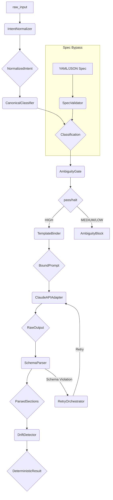

# Architecture

This document provides a high-level overview of the DetermBot architecture.

## Pipeline Data Flow

The DetermBot agent processes user input through a pipeline of components. Each component is responsible for a specific task, ensuring a clear separation of concerns.

The following diagram illustrates the data flow through the pipeline:

## Components

- **IntentNormalizer:** The first stage of the pipeline, responsible for collapsing synonyms and extracting verbs and nouns from the raw input.
- **CanonicalClassifier:** A rule-based classifier that determines the user's intent based on the normalized input.
- **AmbiguityGate:** A gate that halts the pipeline if the classification confidence is below a certain threshold (e.g., HIGH).
- **TemplateBinder:** Binds the classification to a structural template, creating a `BoundPrompt`.
- **ClaudeAPIAdapter:** A wrapper around the Claude API that enforces a locked configuration (e.g., `temperature=0`) to ensure determinism.
- **SchemaParser:** Parses and validates the raw output from the Claude API, extracting the different sections of the response.
- **DriftDetector:** A component that compares the hash of the generated content with previous hashes for the same intent to detect any drift or non-deterministic behavior.
- **RetryOrchestrator:** A control component that orchestrates retries if the schema validation fails.
- **SpecValidator:** A bypass component that validates YAML/JSON specifications, allowing users to provide a pre-canned intent that skips the normalization and classification stages.
- **Agent:** The main orchestrator that manages the entire pipeline.

For more detailed information on each component, please refer to the [Components](./components/) section.
