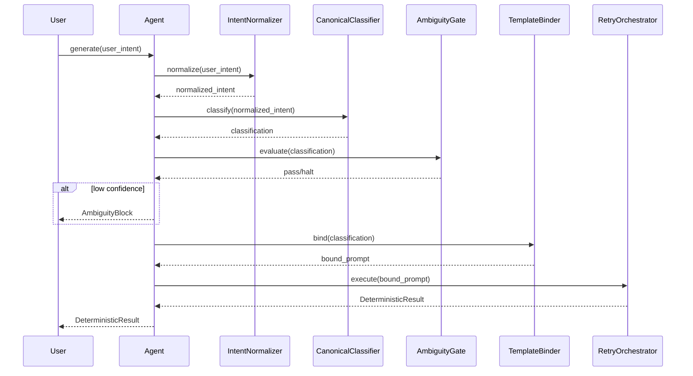

# Agent

The `DeterministicCodeAgent` is the main orchestrator of the DetermBot pipeline. It is responsible for processing user intent and generating deterministic code.

## Class: `DeterministicCodeAgent`

The `DeterministicCodeAgent` class orchestrates the entire code generation pipeline, from normalizing user intent to detecting drift in the generated code.

### `__init__(self, api_key: str)`

The constructor initializes all the components of the pipeline:

- `IntentNormalizer`
- `CanonicalClassifier`
- `AmbiguityGate`
- `TemplateBinder`
- `ClaudeAPIAdapter`
- `SchemaParser`
- `DriftDetector`
- `SpecValidator`
- `MultiIntentSplitter`
- `RetryOrchestrator`

### `generate(self, user_intent: str, language: str, max_retries: int) -> DeterministicResult`

This is the main method of the agent. It takes the user's intent as a string and returns a `DeterministicResult` object. The method orchestrates the following steps:

1.  **Normalize Language:** Normalizes the language alias (e.g., "js") to its canonical name (e.g., "javascript").
2.  **Normalize Intent:** The user's intent is normalized to a canonical form.
3.  **Spec Bypass:** If the input is a YAML/JSON spec, it bypasses the normalization and classification stages.
4.  **Classify:** The normalized intent is classified into a canonical intent type.
5.  **Ambiguity Gate:** The classification result is evaluated by the ambiguity gate. If the confidence is low, the process is halted.
6.  **Bind Template:** The classification is bound to a structural template to create a `BoundPrompt`.
7.  **Execute with Retry:** The `RetryOrchestrator` executes the code generation, with retries in case of schema validation failures.

### `generate_multi(self, user_intent: str, language: str, max_retries: int) -> list[DeterministicResult]`

This method handles multi-intent inputs. It splits the user's intent into multiple sub-intents and runs the generation pipeline for each sub-intent.

### `reset_session(self) -> None`

This method resets the drift detector's session map. It is primarily used for testing purposes.

## Pipeline Orchestration

The `generate` method orchestrates the pipeline as follows:

