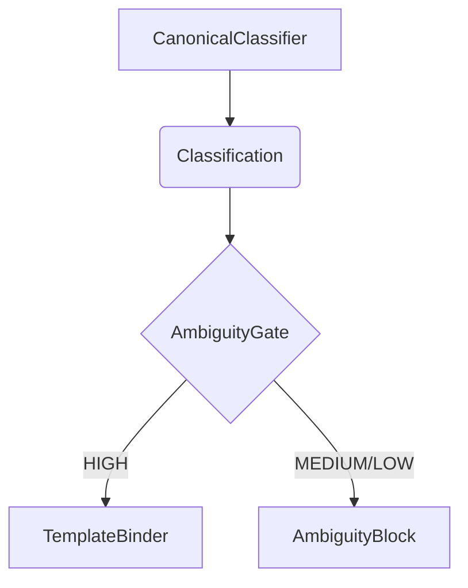

# Ambiguity Gate

The `AmbiguityGate` is a critical component in the DetermBot pipeline that ensures only high-confidence classifications proceed to the code generation stage.

## Class: `AmbiguityGate`

The `AmbiguityGate` acts as a hard gate between the `CanonicalClassifier` and the `TemplateBinder`.

### `evaluate(self, classification: Classification) -> Classification | AmbiguityBlock`

This method takes a `Classification` object and evaluates its confidence level.

-   If the confidence is `HIGH`, it allows the classification to pass through unchanged.
-   If the confidence is `MEDIUM` or `LOW`, it halts the pipeline and returns an `AmbiguityBlock` object.

### `_build_ambiguity_block(self, classification: Classification) -> AmbiguityBlock`

This private method constructs the `AmbiguityBlock` when the confidence is not `HIGH`. It provides a structured response that includes:

-   `unclear_dimension`: A description of what is ambiguous.
-   `clarifying_question`: A question to the user to resolve the ambiguity.
-   `assumed_interpretation`: The interpretation the agent would have taken if forced to proceed.

## Role in the Pipeline

The `AmbiguityGate` is a key part of the "Fail loudly, never silently" design principle. By halting the pipeline on ambiguity, it prevents the agent from generating code based on a weak or incorrect understanding of the user's intent.

