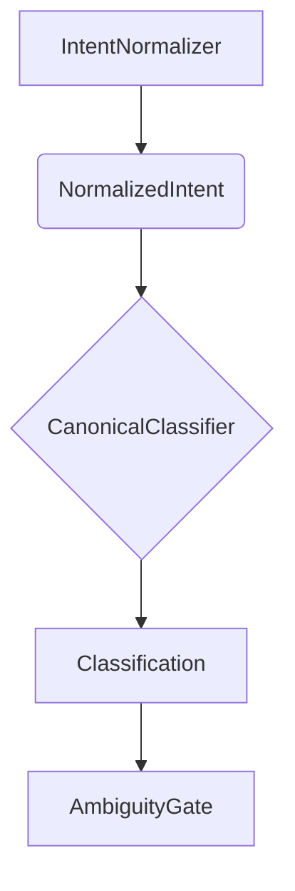

# Canonical Classifier

The `CanonicalClassifier` is the second stage of the DetermBot pipeline. It is a rule-based classifier that maps a `NormalizedIntent` to a `CanonicalType` with a confidence level.

## Class: `CanonicalClassifier`

### `classify(self, normalized: NormalizedIntent, language: str) -> Classification`

This method takes a `NormalizedIntent` object and a language string, and returns a `Classification` object. It evaluates a set of rules to determine the most likely `CanonicalType` for the given intent.

The confidence level is determined as follows:

-   `HIGH`: Exactly one rule matches.
-   `MEDIUM`: Two or more rules match. The highest priority match is chosen.
-   `LOW`: No rules match. A default fallback is used.

### `_evaluate_rules(self, normalized: NormalizedIntent) -> list[CanonicalType]`

This private method contains the rule-based logic for classification. It returns a list of all matching `CanonicalType`s, ordered by priority. The rules are based on keywords and canonical verbs found in the normalized intent.

## Rule-Based Classification

The classifier uses a set of predefined keywords and verb mappings to classify the intent. For example:

-   **PREDICATE:** Matches keywords like "is", "has", "can", "should", or the verb "validate".
-   **AGGREGATOR:** Matches keywords like "reduce", "sum", "count", in combination with collection nouns.
-   **SIDE_EFFECT_OP:** Matches I/O-related verbs like "save", "delete", "send".

The rules are ordered by priority to resolve cases where multiple rules match.

## Role in the Pipeline

The `CanonicalClassifier` is a core component that translates the user's natural language intent into a structured, machine-readable format that can be used by the downstream components.

