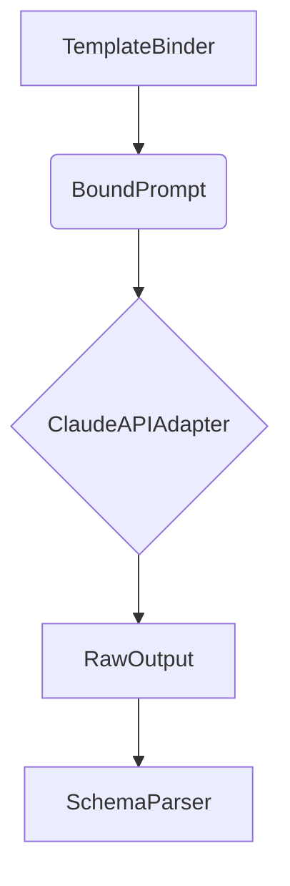

# Claude API Adapter

The `ClaudeAPIAdapter` is the fourth stage of the DetermBot pipeline. It is responsible for making calls to the Claude API with a locked configuration to ensure determinism.

## Class: `ClaudeAPIAdapter`

### `__init__(self, api_key: str)`

The constructor initializes the `anthropic` client and asserts that the temperature is set to 0 and the model is pinned to a specific version. This is a critical part of the determinism guarantee.

### `call(self, bound_prompt: BoundPrompt, trace_id: str = "", attempt: int = 1) -> str`

This method makes a single call to the Claude API. It takes a `BoundPrompt` object and returns the raw text response from the API.

It also handles logging and tracing, recording information such as the model, temperature, tokens, latency, and content hash.

## Locked Configuration

The `ClaudeAPIAdapter` enforces the following configuration for all API calls:

-   **Model:** Pinned to a specific version (e.g., `claude-sonnet-4-20250514`). It does not use "latest" or "preview" tags.
-   **Temperature:** Locked to `0` to ensure deterministic output.
-   **Max Tokens:** Set to a fixed value (e.g., `2048`).

These constraints are essential for the "Determinism over creativity" design principle.

## Role in the Pipeline

The `ClaudeAPIAdapter` is the bridge between the DetermBot agent and the underlying language model. It abstracts the details of the API call and enforces the necessary constraints for deterministic code generation.

