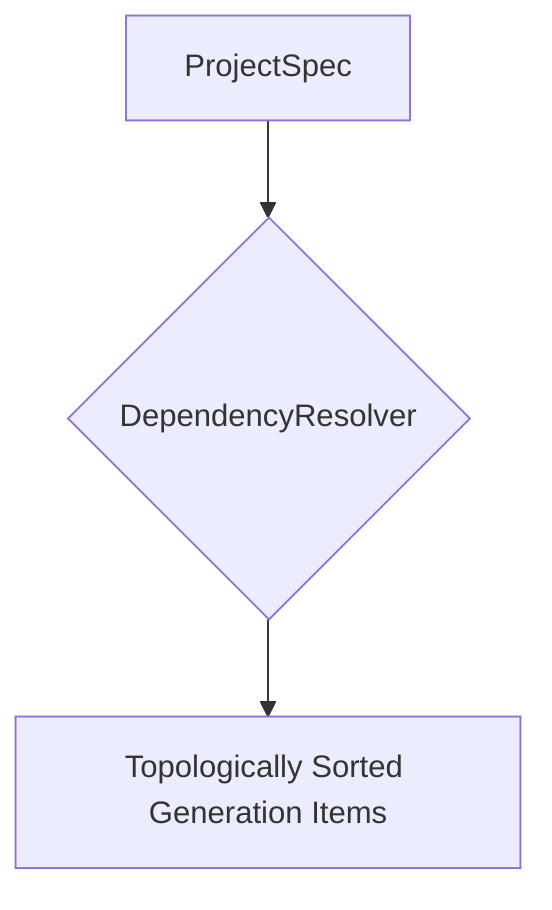

# Dependency Resolver

The `DependencyResolver` is a component used in the Project Composer feature. It is responsible for resolving the build order for a `ProjectSpec` by analyzing the dependencies between functions and data contracts.

## Class: `DependencyResolver`

### `resolve(self, spec: ProjectSpec) -> list[GenerationItem]`

This method takes a `ProjectSpec` and returns a topologically sorted list of `GenerationItem` objects. The sorting is based on the following rules:

1.  Data contracts have no dependencies and are always generated first.
2.  Functions may depend on data contracts if the contract name appears in the function's intent text.
3.  Functions within the same module are ordered as declared.

The method uses Kahn's algorithm for deterministic topological sorting to produce a stable and predictable build order.

### `_build_contract_intent(self, contract: DataContractSpec) -> str`

This private method builds a generation intent for a data contract.

### `_detect_contract_deps(self, intent: str, contract_names: frozenset[str], contracts: tuple[DataContractSpec, ...]) -> list[str]`

This private method detects which data contracts a function intent references.

### `_topological_sort(self, graph: dict[str, list[str]]) -> list[str]`

This private method implements Kahn's algorithm for deterministic topological sorting.

## Error Handling

The resolver can raise a `CyclicDependencyError` if the dependency graph contains a cycle.

## Role in Project Composition

The `DependencyResolver` is a key component of the project composition feature, enabling the generation of multi-file projects with complex interdependencies.

