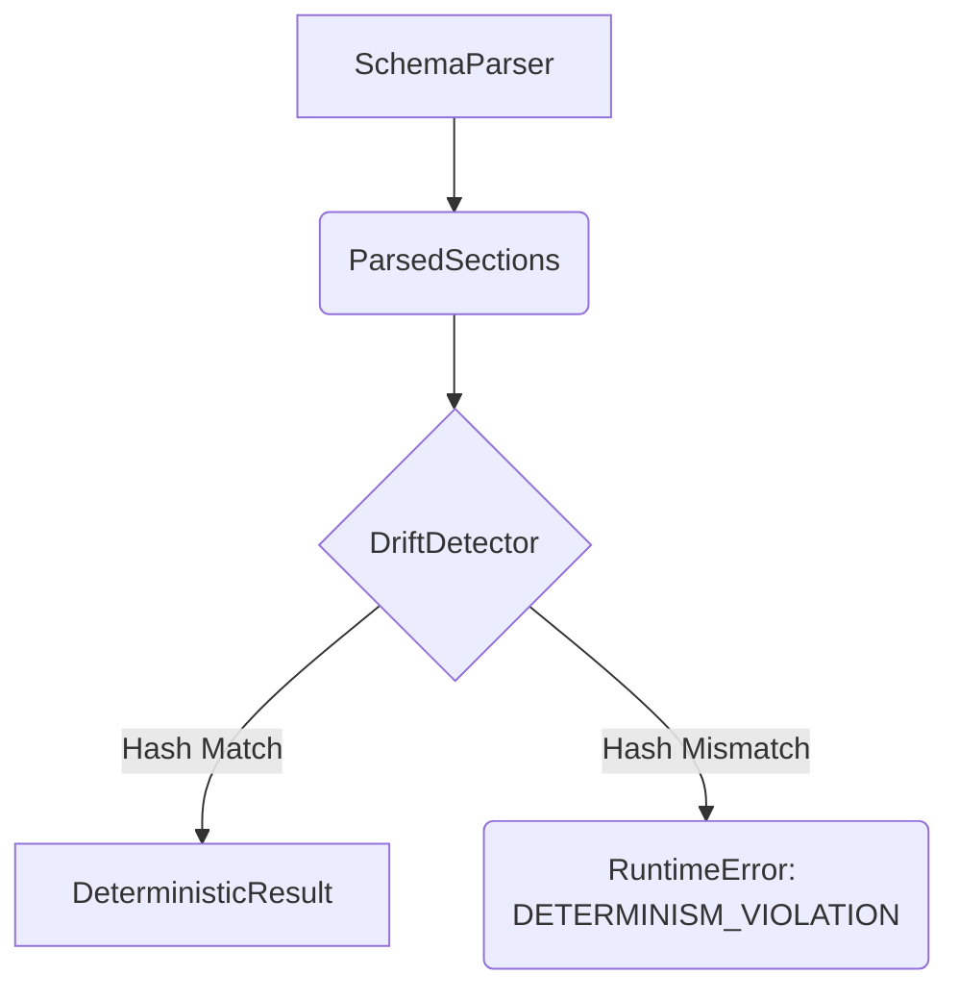

# Drift Detector

The `DriftDetector` is a crucial component for enforcing the "Determinism over creativity" design principle. It is responsible for detecting any drift or non-deterministic behavior in the generated code.

## Class: `DriftDetector`

### `check(self, intent_key: str, content_hash: str) -> None`

This method compares the `content_hash` of the generated code with a session-scoped map of hashes.

-   If the `intent_key` is already in the session map, it compares the new `content_hash` with the stored one. If they do not match, it raises a `RuntimeError` with the message `DETERMINISM_VIOLATION`.
-   If the `intent_key` is not in the session map, it stores the `content_hash` for future comparisons.

### `compute_intent_key(self, verb: str, noun: str, language: str, intent_type: str) -> str`

This static method computes a unique key for a given intent based on its canonical verb, noun, language, and intent type. This key is used to index the session hash map.

### `reset(self) -> None`

This method clears the session hash map. It is primarily used for testing purposes.

## Role in the Pipeline

The `DriftDetector` is the final check in the pipeline before the result is returned. It ensures that for the same intent, the generated code is always the same within a session.

