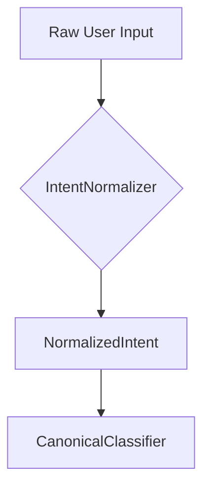

# Intent Normalizer

The `IntentNormalizer` is the first stage of the DetermBot pipeline. It is responsible for collapsing user input into a canonical verb and noun representation by using a synonym table.

## Class: `IntentNormalizer`

### `normalize(self, raw_input: str, language: str) -> NormalizedIntent`

This method takes the raw user input as a string and returns a `NormalizedIntent` object. It performs the following steps:

1.  **Normalize Text:** The input text is normalized to a standard Unicode form.
2.  **Detect YAML Spec:** It checks if the input is a YAML spec. If so, it bypasses the normalization process.
3.  **Extract Verb:** It extracts the canonical verb from the text by matching against a synonym table.
4.  **Extract Noun:** It derives a PascalCase noun from the remaining text after verb extraction.

### `_extract_verb(self, text: str) -> str | None`

This private method finds the canonical verb by matching against the synonym table. It prioritizes multi-word synonyms.

### `_extract_noun(self, text: str, verb: str | None) -> str`

This private method derives a PascalCase noun from the text. It uses a default noun for common verbs if no explicit noun is found.

## Synonym Table

The `IntentNormalizer` uses a synonym table to map different user phrasings to a canonical verb. For example:

| Synonyms                    | Canonical |
| --------------------------- | --------- |
| add, sum, plus, combine     | `add`     |
| subtract, minus, remove from | `subtract`|
| multiply, times, product    | `multiply`|

## Role in the Pipeline

The `IntentNormalizer` is the first step in processing the user's intent. It is a crucial component for achieving determinism, as it ensures that different phrasings of the same intent are mapped to the same canonical representation.

