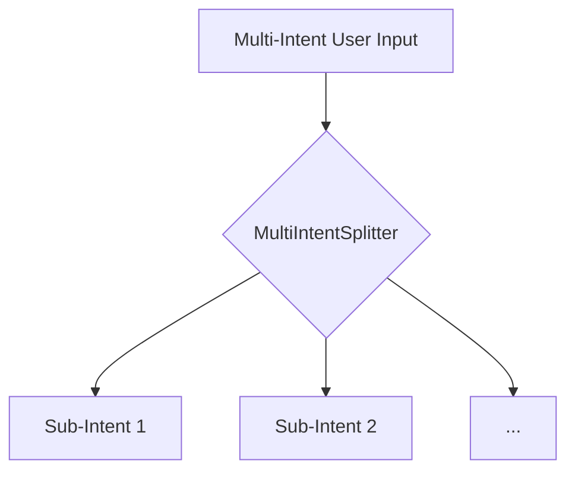

# Multi-Intent Splitter

The `MultiIntentSplitter` is a component that handles multi-function decomposition. It is responsible for splitting multi-intent requests into independent sub-intents.

## Class: `MultiIntentSplitter`

### `split(self, raw_input: str) -> list[str]`

This method takes a raw user intent as a string and returns a list of one or more sub-intent strings. It uses a set of heuristics to detect if the input contains multiple intents.

The splitting logic is based on the following patterns:

-   **Numbered Lists:** It looks for numbered lists (e.g., "1. add 2. subtract").
-   **Comma-Separated Operations:** It checks for comma-separated verb phrases.
-   **Conjunctions:** It splits the input based on conjunctions like "and" or "and also".

The splitter also contains logic to avoid decomposing phrases that look like a single compound concept (e.g., "calculator", "crud api").

## Role in the Pipeline

The `MultiIntentSplitter` is used by the `DeterministicCodeAgent`'s `generate_multi` method to handle multi-intent requests. It allows the agent to process each sub-intent independently through the entire pipeline.

