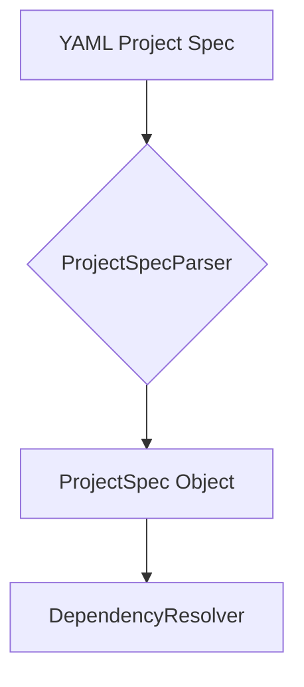

# Project Spec

The `project_spec.py` module contains the parser for project-level specifications. This is the entry point for the Project Composer feature, which allows for the generation of multi-function projects from a YAML spec.

## Class: `ProjectSpecParser`

### `parse(self, spec_input: str) -> ProjectSpec`

This method parses a YAML string into a `ProjectSpec` object. It validates the structure of the spec and raises a `ProjectSpecError` if the spec is invalid.

## Data Classes

The module also defines the data classes that represent the structure of a project spec:

-   `FunctionSpec`: A single function intent within a module.
-   `DataContractSpec`: A shared type definition used across modules.
-   `ModuleSpec`: A group of related functions forming a single file/module.
-   `ProjectSpec`: The top-level project specification.

## YAML Spec Structure

A project spec is a YAML file with the following structure:

```yaml
project:
  name: my-project
  language: javascript
  description: A sample project.
  data_contracts:
    - name: User
      fields:
        id: string
        name: string
  modules:
    - name: auth
      functions:
        - intent: create a function to hash a password
        - intent: create a function to verify a password
```

## Role in Project Composition

The `ProjectSpecParser` is the first step in the project composition workflow. It parses the high-level project specification into a structured format that can be used by the `DependencyResolver` to determine the build order.


