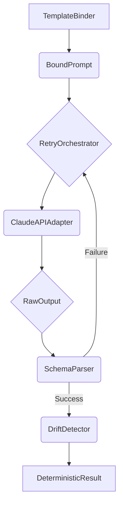

# Retry Orchestrator

The `RetryOrchestrator` is a control component that manages the retry loop for API calls in case of schema failures.

## Class: `RetryOrchestrator`

### `execute(self, bound_prompt: BoundPrompt, intent_key: str, max_retries: int = 3, trace_id: str = "") -> DeterministicResult`

This method executes the API call with a retry loop. It takes a `BoundPrompt`, an `intent_key` for drift detection, the maximum number of retries, and a `trace_id`.

The method performs the following steps:

1.  **Make API Call:** It calls the `ClaudeAPIAdapter` to make an API call.
2.  **Check for Ambiguity:** It checks if the raw output contains an ambiguity block.
3.  **Parse Schema:** It uses the `SchemaParser` to parse the raw output.
4.  **Handle Schema Failure:** If the schema validation fails, it appends a retry suffix to the user message and retries the API call.
5.  **Check for Drift:** If the schema validation is successful, it computes the content hash and uses the `DriftDetector` to check for any drift.
6.  **Return Result:** If all checks pass, it returns a `DeterministicResult`.

If the schema validation fails after the maximum number of retries, it raises a `ValueError`.

## Role in the Pipeline

The `RetryOrchestrator` improves the robustness of the pipeline by automatically handling transient schema validation failures. It encapsulates the retry logic, keeping the main agent logic clean and focused on the primary workflow.

