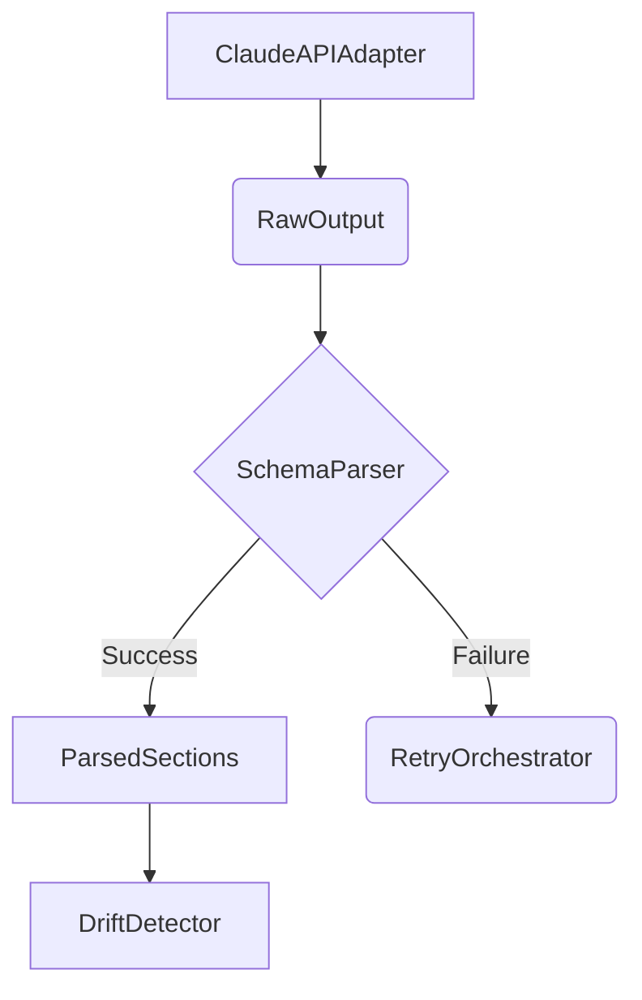

# Schema Parser

The `SchemaParser` is the fifth stage of the DetermBot pipeline. It is responsible for parsing the raw output from the Claude API into a typed `ParsedSections` object.

## Class: `SchemaParser`

### `parse(self, raw_output: str) -> Optional[ParsedSections]`

This method takes the raw output from the Claude API as a string and returns a `ParsedSections` object, or `None` if the parsing fails.

The method performs the following steps:

1.  **Check for Ambiguity:** It checks if the raw output contains an `---AMBIGUITY---` section.
2.  **Extract Sections:** It uses a regular expression to extract all the sections (e.g., `---INTENT_CLASSIFICATION---`, `---SIGNATURE---`) from the raw output.
3.  **Validate Required Sections:** It validates that all the required sections are present.
4.  **Extract and Validate Implementation:** It extracts the implementation code from the `---IMPLEMENTATION---` section and validates that it does not contain any import statements.
5.  **Return ParsedSections:** If all validations pass, it returns a `ParsedSections` object.

### `is_ambiguity(self, raw_output: str) -> bool`

This method checks if the raw output contains an `---AMBIGUITY---` section.

## Role in the Pipeline

The `SchemaParser` is a critical component for ensuring the structural integrity of the generated code. It validates that the output from the language model conforms to the expected schema before it is passed to the downstream components.

