# Spec Validator

The `SpecValidator` is a bypass component in the DetermBot pipeline that handles YAML/JSON spec input. It allows users to provide a pre-canned, canonical intent that skips the synonym normalization and classification stages.

## Class: `SpecValidator`

### `validate(self, spec_input: str) -> Classification`

This method takes a YAML or JSON spec as a string and returns a `Classification` object with `confidence=HIGH`.

The method performs the following steps:

1.  **Parse Input:** It parses the input as YAML or JSON.
2.  **Validate Fields:** It validates that all the required fields (`intent`, `verb`, `noun`, `language`) are present.
3.  **Create NormalizedIntent:** It creates a `NormalizedIntent` object from the spec.
4.  **Create Classification:** It creates a `Classification` object with `confidence=HIGH`.

If the spec is invalid, it raises a `SchemaError`.

## Role in the Pipeline

The `SpecValidator` provides a way to bypass the natural language understanding part of the pipeline and directly feed a canonical intent to the `TemplateBinder`. This is useful for testing, automation, and for cases where the user wants to be explicit about the desired output.

```mermaid
graph TD
    subgraph "Standard Pipeline"
        A[Raw User Input] --> B(IntentNormalizer);
        B --> C(CanonicalClassifier);
    end
    subgraph "Spec Bypass"
        D[YAML/JSON Spec] --> E{SpecValidator};
    end
    C --> F[Classification];
    E --> F;
    F --> G[AmbiguityGate];
```

