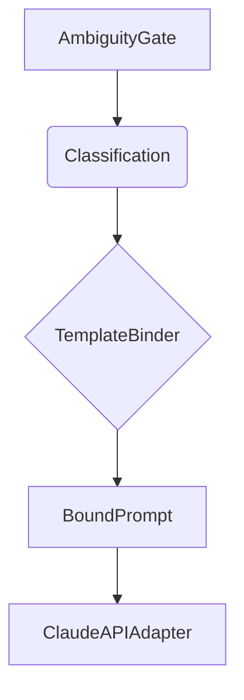

# Template Binder

The `TemplateBinder` is the third stage of the DetermBot pipeline. It is responsible for binding a `Classification` to a structural prompt template, producing a `BoundPrompt` that is ready for the Claude API.

## Class: `TemplateBinder`

### `bind(self, classification: Classification) -> BoundPrompt`

This method takes a `Classification` object and returns a `BoundPrompt`. It performs the following steps:

1.  **Resolve Function Name:** It resolves the canonical function name based on the `CanonicalType` and the target language.
2.  **Format User Message:** It formats the user message for the Claude API call, including the language target, intent type, canonical verb and noun, and the resolved function name.
3.  **Create BoundPrompt:** It creates a `BoundPrompt` object containing the system prompt and the formatted user message.

### `_resolve_function_name(self, classification: Classification) -> str`

This private method applies a set of naming rules to derive the canonical function name. The rules are specific to each `CanonicalType` and target language. For example:

-   `PURE_FUNCTION`: `noun_only` (e.g., `total`)
-   `PREDICATE`: `is_prefix` (e.g., `isEvenNumber`)
-   `TRANSFORMER`: `to_prefix` (e.g., `toUserDto`)

It also handles language-specific casing (e.g., `snake_case` for Python).

## Role in the Pipeline

The `TemplateBinder` is responsible for constructing the final prompt that will be sent to the language model. It ensures that the prompt is structured in a way that maximizes the chances of getting a deterministic and schema-compliant response.

