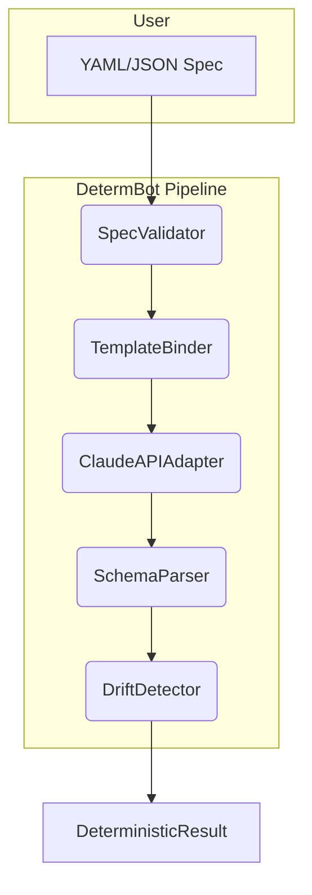
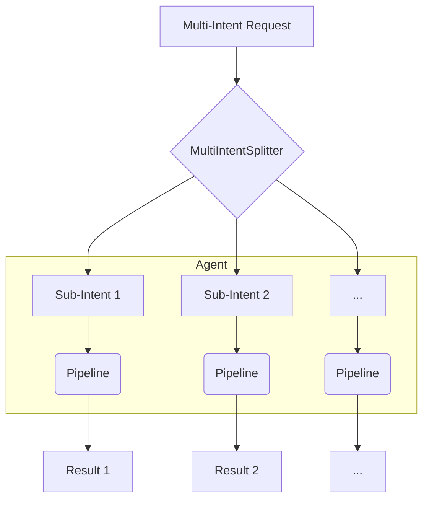
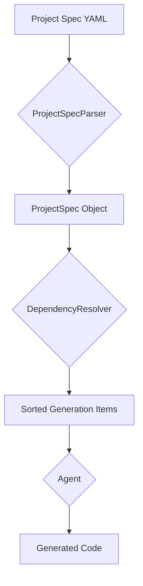

# Images and Diagrams

This page contains a collection of diagrams that illustrate various architectural decisions and important use cases of the DetermBot agent.

## Spec-Driven Development (SDD) Workflow

This diagram shows the workflow of using a YAML spec to generate code. The spec bypasses the natural language understanding part of the pipeline and directly feeds a canonical intent to the `TemplateBinder`.

## Multi-Intent Request Flow

This diagram shows how a multi-intent request is split and processed by the agent.

## Project Composition Flow

This diagram shows the flow of composing a project from a project spec.

